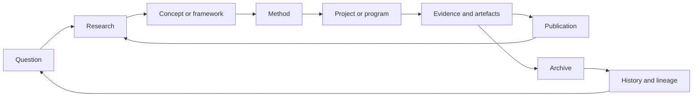
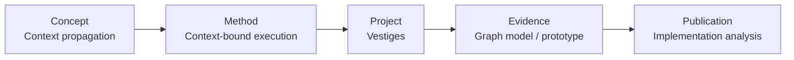
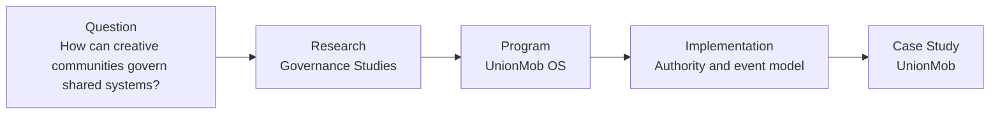

# Electronic Artefacts: Knowledge Platform Architecture, 2026–2031

**Design date:** 22 June 2026  
**Purpose:** Define the next evolution of Electronic Artefacts as a studio, research organization, software lab, cultural platform, label and publishing institution.  
**Premise:** This document begins where the discoverability audit ended. It is a target operating model and implementation program, not another audit.

## Strategic decision

Electronic Artefacts should become a **public research and production graph**: an institution that publishes ideas, methods, systems, cultural works and the evidence connecting them.

It should not become a blog with graph decoration. The graph must be the editorial system.

Every durable public object should have an identity. Every publication should add knowledge to one or more objects. Every project should demonstrate concepts and methods. Every important claim should lead to evidence. Every archived trace should retain provenance. Every relationship should state what connects two entities and why.

The platform must serve two complementary modes:

- **Practice:** what Electronic Artefacts builds, produces, publishes and preserves.
- **Knowledge:** what Electronic Artefacts has learned, defined, tested and can substantiate.

Its central institutional loop is:



This loop makes the site more valuable with time. A publication is not merely added to a feed: it clarifies concepts, documents projects, interprets evidence, enriches collections and updates the history of the institution.

---

# Phase 1 — Current assets inventory

## 1.1 Existing public institutional surfaces

The current site already has six of the required platform domains, although “Publications” and “Knowledge” are distributed across other sections rather than established as first-class systems.

| Existing surface | Current function | Future institutional role |
|---|---|---|
| Home | Orientation and selected paths | Institutional front door |
| Work | Applied work and engagement contexts | Practice and case-study gateway |
| Projects | Project constellation | Project registry |
| Programs | Runtimes, software and operating systems | Program registry and technical documentation |
| Research | Research fields and process | Research registry and question space |
| Archive | Artefacts, records and collections | Evidence and preservation layer |
| About | Ecosystem and lineage explanation | Institutional identity and governance |
| Search | Entity retrieval | Unified knowledge retrieval |
| Palimpsests | Artistic dossier | Model for a compound cultural publication |

The future architecture should not discard these surfaces. It should assign each one a sharper institutional responsibility.

## 1.2 Existing public entities

The data model contains 70 entities. Forty-seven are currently public or archival:

| Entity class | Public/archive | Existing assets |
|---|---:|---|
| Programs | 6 | VASTE, ARCA, OracleHub, ORETH, Forge, Lightweight Template |
| Artists and collaborators | 4 | ORETH, Noi.Save, Marjolaine Muller, Zarah Nkounkou |
| Channels | 2 | Electronic Artefacts, CreativeStuff.jpg |
| Research fields | 11 | VOID, Entropy, Emergence, Runtime Theory, Systems Theory, Information Studies, Anthropic Studies, Signal Archaeology, Artifact Theory, Graph Runtime Studies, Simulation Studies |
| Projects | 7 | Palimpsests, Vestiges, UnionMob, L’Œil de Meg, 7 Temps Seulement, Electronic Artefacts Website, null_human |
| Artefacts | 13 | Audio works, archival records and preserved fragments |
| Research logs | 2 | Foundational Lineage #001, Visual Reference #001 |
| Universes | 2 | Palimpsests Universe, Null Universe |

Eight collections are public:

- Palimpsests Collection
- Entropy Studies Collection
- Vestiges Collection
- Visual Research Collection
- VASTE Lab Collection
- UnionMob Collection
- Runtime Collection
- Client Work Collection

Seven entities already have populated timelines:

- VASTE
- ORETH
- Palimpsests
- Vestiges
- Electronic Artefacts
- Entropy Studies
- UnionMob

These are not content ideas. They are existing knowledge assets that need stronger publication contracts.

## 1.3 What already behaves like knowledge

The following assets already function as knowledge and should be refined rather than recreated:

- **Research fields** are proto-concept and proto-domain pages.
- **Program descriptions** contain architectural lineage, technical responsibilities and research context.
- **Project dossiers** contain applied systems thinking and evidence of implementation.
- **Taxonomies** distinguish maturity, confidence, visibility, status, temporality, medium and discipline.
- **Relations** express origin, dependency, influence, derivation, production, publication, maintenance and containment.
- **Collections** create editorial neighborhoods around projects and research.
- **Timelines** represent institutional and project history.
- **Search data** already indexes entities, summaries, tags, media, disciplines and relations.

The key rule is: do not create a second glossary entry when a research field should become the canonical concept page. Do not create a separate “VASTE article” to repeat the program page. Add a publication only when it makes a distinct argument, reports a result or documents an implementation.

## 1.4 What already behaves like documentation

- VASTE program material documents purpose, lineage and system scope.
- UnionMob contains architectural and governance propositions.
- L’Œil de Meg contains implementation and operational-system evidence.
- Programs expose technologies and responsibilities.
- Project media provide visual implementation evidence.
- The Lightweight Template is already a framework record.
- Timelines document development sequences.
- Status, maturity and confidence fields document lifecycle and epistemic state.

These should become formal documentation layers attached to the existing program or project identity, not disconnected articles.

## 1.5 What already behaves like publication

- Palimpsests is a compound artistic publication.
- Foundational Lineage #001 is a research note in all but name.
- Visual Reference #001 is a field or visual note.
- Public research fields contain the seed of definitional publications.
- Audio artefacts are releases and components of a larger publication.
- Project dossiers act as preliminary case studies.

The platform should explicitly classify and cite these existing objects before creating new publication volume.

## 1.6 What already behaves like archive

- archived programs such as ARCA and OracleHub;
- VOID as an archived research/software lineage;
- Legacy Agency Layer;
- audio fragments and releases;
- research logs;
- project and institutional timelines;
- collections that preserve context across entity classes;
- visibility and confidence states that retain uncertainty rather than erase it.

The archive should remain a provenance system. It should never be reduced to “old posts.”

## 1.7 Existing assets that should not be duplicated

| Need | Existing asset to evolve | Do not create |
|---|---|---|
| Runtime knowledge hub | Runtime Collection | A separate generic runtime category |
| VASTE research hub | VASTE Lab Collection | A duplicate VASTE blog |
| Palimpsests publication | Palimpsests dossier and collection | Separate posts for material already in the dossier |
| Entropy research hub | Entropy Studies and collection | A duplicate glossary page with the same text |
| Project proof | Existing project dossiers and media | Promotional summaries that restate project cards |
| Institutional history | Existing timelines | Chronological news archive |
| Visual research | CreativeStuff.jpg and Visual Research Collection | Generic design-trend articles |
| Client work | Client Work Collection and project pages | An agency portfolio duplicated under “case studies” |

---

# Phase 2 — Knowledge platform architecture

## 2.1 Six institutional domains

The public platform should be organized around six domains:

1. **Projects** — bounded initiatives that apply knowledge and produce outcomes.
2. **Programs** — sustained systems, runtimes, laboratories or operating capabilities.
3. **Research** — questions, fields, investigations, notes and results.
4. **Publications** — authored intellectual or cultural outputs.
5. **Knowledge** — canonical concepts, methods, frameworks and technologies.
6. **Archive** — evidence, records, artefacts, versions and historical context.

These domains answer different questions:

| Domain | Primary question |
|---|---|
| Projects | What was made, for whom, under what constraints and with what result? |
| Programs | What sustained capability or system exists? |
| Research | What question is being investigated, and what is known? |
| Publications | What has Electronic Artefacts formally stated or released? |
| Knowledge | What does a term mean, how is it used and where is it demonstrated? |
| Archive | What evidence remains, where did it come from and what does it document? |

## 2.2 Primary navigation

Recommended primary navigation:

```text
WORK
RESEARCH
KNOWLEDGE
ARCHIVE
ABOUT
SEARCH
```

“Work” is the accessible umbrella for Projects and Programs. It is retained because potential clients, collaborators and general visitors understand it immediately.

The expanded navigation exposes:

```text
WORK
  Projects
  Programs
  Case Studies

RESEARCH
  Questions
  Fields
  Research Notes
  Publications

KNOWLEDGE
  Concepts
  Methods
  Frameworks
  Technologies
  Knowledge Maps

ARCHIVE
  Collections
  Artefacts
  Timelines
  Releases

ABOUT
  Electronic Artefacts
  People and Organizations
  Institutional Lineage
  Collaboration
```

Publications belongs under Research in navigation but remains a first-class URL and entity type. This keeps the main navigation concise without hiding the publishing system.

## 2.3 URL architecture

```text
/
/work/
/projects/
/projects/{project}/
/programs/
/programs/{program}/
/case-studies/{case-study}/

/research/
/research/questions/
/research/questions/{question}/
/research/fields/
/research/fields/{field}/
/research/notes/
/research/notes/{note}/

/publications/
/publications/essays/
/publications/technical/
/publications/field-notes/
/publications/experimental/
/publications/{publication}/

/knowledge/
/knowledge/concepts/
/knowledge/concepts/{concept}/
/knowledge/methods/
/knowledge/methods/{method}/
/knowledge/frameworks/
/knowledge/frameworks/{framework}/
/knowledge/technologies/
/knowledge/technologies/{technology}/
/knowledge/maps/{map}/

/archive/
/archive/collections/
/archive/collections/{collection}/
/archive/artefacts/
/archive/artefacts/{artefact}/
/archive/timelines/
/archive/timelines/{timeline}/
/archive/releases/

/artists/{artist}/
/organizations/{organization}/
/datasets/{dataset}/
/events/{event}/
```

The URL hierarchy is a publication convention, not the graph hierarchy. An entity can participate in many contexts while retaining one canonical URL.

## 2.4 Secondary navigation

Every detail page should have a local navigation rail generated from its entity type.

Example for a program:

```text
Overview
Architecture
Research
Implementations
Publications
Evidence
Timeline
Related entities
Citation
```

Example for a concept:

```text
Definition
Scope
Electronic Artefacts position
Related methods
Applied projects
Evidence
Publications
References
History
```

Example for a project:

```text
Overview
Problem and context
Approach
System
Outcomes
Evidence
Concepts and methods
Timeline
Credits
```

These are sections within a canonical resource, not necessarily separate pages. Split sections only when the material becomes independently useful and maintainable.

## 2.5 Cross-linking system

Every entity page must expose four kinds of links:

1. **Identity links** — type, owner, status, dates, canonical ID.
2. **Structural links** — part of, has part, program, project, collection.
3. **Knowledge links** — defines, applies, tests, supports, contradicts.
4. **Historical links** — derived from, supersedes, preceded by, evidenced by.

Cross-links should be sentences when meaning matters:

> Vestiges applies the VASTE graph runtime to the preservation and activation of cultural and craft knowledge.

This is stronger than displaying “VASTE” and “Vestiges” as adjacent tags.

## 2.6 Relationship visualization

Use three graph views, each with a specific purpose:

- **Local neighborhood:** one entity and its first-degree typed relations. Default detail-page graph.
- **Knowledge map:** an editorially curated graph explaining a territory, such as graph runtimes or computational archives.
- **Lineage map:** a temporal graph showing origins, derivations, versions and successors.

Do not expose the complete graph as the default interface. A 70-node graph is useful to inspect but poor for comprehension. The complete graph should be available as an explorer and data export, while editorial views explain why a subset matters.

## 2.7 Discovery mechanisms

The platform should support:

- search by title, definition, abstract, full text, entity type and relation;
- browse by entity type;
- browse by research question;
- browse by topic territory;
- browse by collection;
- browse by timeline;
- browse by confidence and maturity;
- browse by audience-specific path;
- follow a typed relationship;
- inspect “where this concept is applied”;
- inspect “what evidence supports this publication”;
- inspect “what changed since this version.”

## 2.8 Search strategy

Search should return entities and answers, not only matching cards.

A result should show:

- canonical title;
- entity type;
- one-sentence definition or abstract;
- matched passage;
- status and confidence where relevant;
- primary relationships;
- updated date.

Search modes:

- **Exact entity:** “VASTE”
- **Question:** “What is a graph runtime?”
- **Relationship:** “projects powered by VASTE”
- **Evidence:** “evidence for contextual execution”
- **Temporal:** “UnionMob decisions in 2026”
- **Format:** “technical articles about governance”

The same structured corpus should power human search, site APIs and public retrieval exports.

## 2.9 Required user journeys

### Knowledge-to-practice journey



At every step, the page explains why the next relation exists.

### Question-to-case-study journey



These journeys should be generated from relationships but editorially reviewed. Automation can propose a path; an editor decides whether it communicates a coherent argument.

---

# Phase 3 — Entity strategy

## 3.1 Entity publication classes

Not every modeled entity deserves an indexable page. Use four publication classes:

| Class | Meaning | Index policy |
|---|---|---|
| Canonical | Authoritative, maintained identity with standalone value | Index |
| Published | Stable public record or output | Index |
| Supporting | Public graph node with insufficient standalone depth | Consolidate; index only when useful |
| Internal | Operational, sensitive, incomplete or rights-restricted | Never index |

Confidence and publication class must remain separate. A speculative concept can be canonically documented as speculative. “Canonical” should mean the record is authoritative about its own state, not that its proposition is proven.

## 3.2 Ideal entity model

Every entity has a shared core:

```text
id
canonicalUrl
type
title
alternateNames
definitionOrAbstract
description
publicationClass
status
maturity
confidence
visibility
createdAt
publishedAt
modifiedAt
version
authors
contributors
publisher
licenseOrRights
relations[]
sources[]
citations[]
changeHistory[]
```

Type-specific fields extend this core.

### Concept

- definition;
- scope and exclusions;
- origin of term;
- claims;
- contrasting concepts;
- applications;
- references.

### Method

- purpose;
- inputs;
- procedure;
- outputs;
- assumptions;
- limits;
- examples;
- implementations.

### Framework

- principles;
- components;
- model;
- evaluation criteria;
- applications;
- known limitations.

### Technology

- category;
- role in the ecosystem;
- versions;
- implementation decisions;
- dependencies;
- projects using it.

### Research field

- central questions;
- scope;
- methods;
- current findings;
- publications;
- related projects;
- bibliography;
- open questions.

### Project

- brief;
- problem;
- context;
- stakeholders;
- constraints;
- approach;
- concepts and methods applied;
- program dependencies;
- outputs;
- outcomes;
- evidence;
- credits.

### Program

- mandate;
- architecture;
- capabilities;
- lifecycle;
- versions;
- research inputs;
- project implementations;
- documentation;
- maintainers.

### Publication

- format;
- abstract;
- body;
- claims;
- references;
- subjects;
- supporting evidence;
- author;
- review status;
- citation.

### Artist or person

- authoritative name;
- biography;
- roles;
- works;
- affiliations;
- timeline;
- external identifiers;
- consent and rights status.

### Organization

- type;
- identity;
- role;
- projects;
- people;
- external identifiers;
- relationship to Electronic Artefacts.

### Collection

- editorial thesis;
- scope;
- selection method;
- curator;
- member entities;
- chronology;
- rights statement.

### Artefact

- material or digital form;
- creator;
- creation date;
- provenance;
- source project;
- condition or version;
- technical metadata;
- rights;
- significance;
- preservation actions.

### Tool

- function;
- user;
- inputs and outputs;
- installation or access;
- version;
- license;
- related methods.

### Dataset

- subject;
- schema;
- methodology;
- provenance;
- size;
- format;
- license;
- version;
- limitations.

### Event

- event type;
- date or interval;
- participants;
- place;
- result;
- evidence.

### Timeline

- subject;
- editorial scope;
- events;
- sources;
- curator;
- update date.

## 3.3 Dedicated-page decisions

| Entity | Dedicated page? | Indexable? | Authority potential |
|---|---:|---:|---:|
| Concept | Yes after editorial threshold | Yes | Very high |
| Method | Yes after repeat use | Yes | Very high |
| Framework | Yes | Yes | Very high |
| Technology | Only with original analysis or implementation | Selective | Medium |
| Research field | Yes | Yes | Very high |
| Project | Yes | Yes | High |
| Program | Yes | Yes | High |
| Publication | Yes | Yes | Very high |
| Artist/person | Yes with consent and sufficient information | Yes | Medium–high |
| Organization | Yes when materially connected | Selective | Medium |
| Collection | Yes when curated, not mechanically aggregated | Yes | High |
| Artefact | Only with provenance and explanatory value | Selective | Medium–high |
| Tool | Yes when public and usable | Yes | High |
| Dataset | Yes when documented and licensable | Yes | High |
| Event | Usually embedded in timelines | Selective | Low alone |
| Timeline | Yes when sourced and editorially meaningful | Yes | High |

## 3.4 What remains internal

Keep internal:

- unpublished client systems or confidential implementations;
- private contact and contractual information;
- incomplete records without a public editorial purpose;
- speculative entities whose publication would falsely imply a commitment;
- raw research logs containing sensitive, unreviewed or rights-unclear material;
- internal production tasks;
- duplicate implementation nodes used only for system operations;
- sources that cannot be redistributed.

Internal nodes can still connect the private graph. Public graph exports must be generated from an explicit allowlist, never by filtering a complete export after generation.

## 3.5 Relationship vocabulary

Avoid a single generic `relatedTo` edge. Use typed predicates grouped by function.

### Intellectual

- `defines`
- `refines`
- `contrastsWith`
- `influencedBy`
- `tests`
- `supportsClaim`
- `contradictsClaim`
- `cites`

### Applied

- `appliesConcept`
- `usesMethod`
- `implementsFramework`
- `usesTechnology`
- `implementedBy`
- `demonstratedBy`

### Production

- `createdBy`
- `contributedBy`
- `producedBy`
- `publishedBy`
- `commissionedBy`
- `maintainedBy`
- `fundedBy`

### Structural

- `hasPart`
- `partOf`
- `memberOfCollection`
- `documents`
- `documentedBy`
- `subjectOf`

### Technical

- `dependsOn`
- `poweredBy`
- `integratesWith`
- `supersedes`
- `versionOf`
- `forkedFrom`

### Evidential

- `evidencedBy`
- `derivedFromArtefact`
- `usesDataset`
- `generatedArtefact`
- `hasSource`

### Temporal

- `precededBy`
- `followedBy`
- `occurredDuring`
- `resultedIn`

Every edge should be reversible where appropriate and carry:

```text
subject
predicate
object
statement
source
confidence
validFrom
validTo
createdAt
reviewedAt
```

The `statement` is a concise human explanation. The source and confidence make the edge auditable.

---

# Phase 4 — Knowledge layers

## 4.1 Four-layer model

Every major territory should support four levels of depth:

| Layer | Reader need | Content behavior |
|---|---|---|
| 1. Public introduction | “Explain this clearly.” | Definition, relevance, examples |
| 2. Research explanation | “What is the argument or question?” | Scope, theory, sources, open questions |
| 3. Technical implementation | “How does it work?” | Architecture, methods, decisions, interfaces |
| 4. Evidence and archive | “How do I verify this?” | Logs, artefacts, versions, datasets, provenance |

These layers are connected resources, not four compulsory pages for every subject. Small topics can contain multiple layers on one page.

## 4.2 Graph runtimes

```text
Layer 1: What is a graph runtime?
Layer 2: Runtime Theory and Graph Runtime Studies
Layer 3: VASTE architecture, contextual execution and identity primitives
Layer 4: VASTE research logs, ARCA lineage, performance notes and prototypes
```

Existing assets reused: Runtime Theory, Graph Runtime Studies, VASTE, ARCA, OracleHub, VASTE Lab Collection, Runtime Collection and VASTE timeline.

## 4.3 Cultural knowledge platforms

```text
Layer 1: What is a living cultural knowledge graph?
Layer 2: Information Studies, Artifact Theory and cultural provenance
Layer 3: Vestiges entity model, contribution system and graph architecture
Layer 4: prototypes, taxonomy records, research notes and Vestiges timeline
```

Existing assets reused: Vestiges, VASTE, Artifact Theory, Information Studies, Graph Runtime Studies and Vestiges Collection.

## 4.4 Creative governance systems

```text
Layer 1: What is a governed creative operating system?
Layer 2: Governance questions, organizational systems and authority models
Layer 3: UnionMob and UMOS architecture, events, projections and service boundaries
Layer 4: governance logs, decision records, prototypes and UnionMob timeline
```

Existing assets reused: UnionMob, internal UnionMob OS program when publishable, UnionMob Collection and timeline.

## 4.5 Computational archives and provenance

```text
Layer 1: What is an electronic artefact?
Layer 2: Signal Archaeology, Information Studies and Artifact Theory
Layer 3: provenance, confidence and lifecycle models
Layer 4: archive records, collections, discarded systems and preserved versions
```

Existing assets reused: Archive, artefacts, collections, Legacy Agency Layer, VOID, ARCA and the confidence taxonomy.

## 4.6 Computational artistic research

```text
Layer 1: How can computation participate in artistic research?
Layer 2: Entropy, Emergence, Anthropic Studies and Signal Archaeology
Layer 3: ORETH signal analysis, pattern recognition and production methods
Layer 4: Palimpsests acts, audio artefacts, field notes, releases and timelines
```

Existing assets reused: ORETH program, ORETH artist, Palimpsests, Palimpsests Collection, Entropy Collection and public audio artefacts.

## 4.7 Research-driven software design

```text
Layer 1: What is research-driven software design?
Layer 2: systems questions, uncertainty and hypothesis formation
Layer 3: Forge, Lightweight Template, VASTE and project-specific architectures
Layer 4: implementation notes, benchmarks, prototypes and case-study evidence
```

Existing assets reused: Programs, project dossiers, Foundational Lineage #001 and existing implementation material.

---

# Phase 5 — Publication system

## 5.1 Publication formats

Lengths are editorial ranges, not ranking formulas.

| Format | Purpose | Primary audience | Typical length | SEO | AI citation | Brand |
|---|---|---|---:|---:|---:|---:|
| Concept page | Establish a canonical definition and scope | All specialist audiences | 800–2,000 words | 5 | 5 | 5 |
| Method page | Document a repeatable practice | Researchers, developers, designers | 1,200–3,000 | 4 | 5 | 5 |
| Research note | Report a bounded question, observation or result | Researchers, peers, AI retrieval | 1,000–2,500 | 4 | 5 | 5 |
| Field note | Preserve a situated observation from practice | Designers, artists, collaborators | 400–1,200 | 3 | 4 | 5 |
| Technical article | Explain architecture, tradeoffs or implementation | Developers, technical institutions | 1,500–4,000 | 5 | 5 | 4 |
| Essay | Make an original, sourced argument | Researchers, artists, institutions | 2,500–7,000 | 4 | 5 | 5 |
| Case study | Demonstrate decisions and outcomes | Clients, institutions, practitioners | 1,500–4,000 | 5 | 4 | 5 |
| Documentation | Explain a maintained system | Users, developers, collaborators | As required | 4 | 5 | 4 |
| Archive record | Preserve provenance and significance | Researchers, archivists, future users | 300–1,500 | 3 | 4 | 5 |
| Experimental publication | Publish work whose form is part of its argument | Artists, researchers, cultural audiences | Variable | 2 | 3 | 5 |

## 5.2 Format contracts

### Concept page

Required:

- one-sentence definition;
- scope and exclusions;
- Electronic Artefacts position;
- related and contrasting concepts;
- applied projects;
- references;
- version and reviewer.

Relationship: concepts are defined or refined by publications and applied by methods, projects and programs.

### Method page

Required:

- problem;
- when to use and not use it;
- inputs;
- procedure;
- outputs;
- assumptions;
- limitations;
- examples;
- evidence.

Relationship: methods operationalize concepts and are used in projects.

### Research note

Required:

- question;
- context;
- method or observation;
- result;
- interpretation;
- limitations;
- related entities;
- references.

Relationship: research notes update a field, support or challenge claims and can later feed essays or technical articles.

### Field note

Required:

- date and context;
- observation;
- media or evidence;
- provisional interpretation;
- confidence;
- relation to active work.

Relationship: field notes enter the archive and may become evidence for research.

### Technical article

Required:

- problem;
- architecture or mechanism;
- alternatives considered;
- decisions and tradeoffs;
- implementation;
- evidence or reproducibility;
- limitations.

Relationship: technical articles explain program or project implementations.

### Essay

Required:

- thesis;
- argument;
- sources;
- counterpositions;
- original contribution;
- conclusion;
- citation.

Relationship: essays can define frameworks or synthesize several research fields.

### Case study

Required:

- context and stakeholders;
- initial condition;
- constraints;
- approach;
- decisions;
- implementation;
- outcome;
- evidence;
- what remains unresolved.

Relationship: case studies prove the application of concepts and methods.

### Documentation

Required:

- version;
- audience;
- system boundary;
- usage or interface;
- change history;
- maintainer;
- support status.

Relationship: documentation belongs to a maintained program, tool, dataset or framework.

### Archive record

Required:

- identifier;
- title;
- creator;
- date;
- format;
- provenance;
- source project;
- rights;
- description;
- significance;
- preservation status.

Relationship: archive records evidence projects, publications and historical events.

### Experimental publication

Required:

- authorship;
- release identity;
- contextual note;
- constituent artefacts;
- rights;
- preservation path.

Relationship: the work can be a project, publication and collection simultaneously, but each role must be explicit.

## 5.3 Editorial workflow

```text
Proposal
→ entity and duplication check
→ format selection
→ draft
→ source and rights review
→ relationship mapping
→ editorial review
→ technical/subject review where required
→ publication
→ indexing and graph export
→ scheduled review
→ supersession or archive
```

Before commissioning a new text, ask:

1. Does this knowledge already exist in an entity, collection or dossier?
2. Is the correct action to enrich that resource?
3. If a new publication is justified, what new claim, result or interpretation does it contribute?
4. Which entities will it define, document, support or challenge?

## 5.4 Publication cadence

Do not optimize for frequency. Use a sustainable institutional cadence:

- 1 substantial publication per month;
- 1–2 research or field notes per month when evidence exists;
- quarterly review of canonical concept pages;
- biannual public graph and bibliography release;
- annual institutional edition summarizing material changes.

Silence is preferable to low-value repetition.

---

# Phase 6 — Topic ownership

## 6.1 Territory 1: Graph runtimes and contextual systems

**Pillar:** What is a graph runtime?

**Canonical nodes:**

- Graph Runtime
- Contextual Execution
- Runtime Identity
- Event Propagation
- Graph Runtime Studies
- Runtime Theory

**Evidence nodes:**

- VASTE
- ARCA
- OracleHub
- Vestiges
- UnionMob

**Supporting publications:**

- Graph runtime versus workflow engine
- Context propagation in mutable systems
- Identity as a runtime primitive
- How VASTE emerged from ARCA
- Event execution, projections and service boundaries
- Limits of graph-based execution

**Knowledge map:** concepts → runtime components → implementations → evidence.

## 6.2 Territory 2: Knowledge architectures

**Pillar:** Designing living knowledge architectures

**Canonical nodes:**

- Knowledge Architecture
- Living Knowledge Graph
- Contextual Knowledge
- Temporal Knowledge
- Tacit Knowledge
- Knowledge Provenance

**Evidence nodes:**

- Vestiges
- Electronic Artefacts Website
- VASTE
- collections and taxonomies

**Supporting publications:**

- Knowledge graph versus content management system
- Modeling changing knowledge without erasing history
- Entities, claims and evidence
- Designing public pages from a graph
- Preserving tacit knowledge without flattening practice

## 6.3 Territory 3: Digital archives and provenance

**Pillar:** The archive as a computational knowledge system

**Canonical nodes:**

- Electronic Artefact
- Computational Archive
- Provenance
- Archival Confidence
- Signal Archaeology
- Artifact Theory

**Evidence nodes:**

- Archive records
- VOID
- ARCA
- Legacy Agency Layer
- Palimpsests artefacts
- timelines

**Supporting publications:**

- Archive, collection and knowledge graph: distinct responsibilities
- Why failed prototypes should remain addressable
- Confidence and uncertainty in digital archives
- Preserving relations as well as objects
- From signal degradation to historical evidence

## 6.4 Territory 4: Cultural knowledge platforms

**Pillar:** Infrastructure for living cultural and craft knowledge

**Canonical nodes:**

- Cultural Knowledge Platform
- Living Heritage Graph
- Craft Knowledge
- Cultural Provenance
- Participatory Knowledge

**Evidence nodes:**

- Vestiges
- VASTE
- Vestiges Collection

**Supporting publications:**

- Actors, practices, materials, places and institutions as graph entities
- Contribution without extraction
- Temporal and contested cultural knowledge
- Public knowledge pages as infrastructure
- Economic services around cultural knowledge

## 6.5 Territory 5: Governance and creative operating systems

**Pillar:** Governed creative operating systems

**Canonical nodes:**

- Creative Operating System
- Governance Primitive
- Organizational Context
- Capability-Based Authority
- Decision Provenance
- Brokered AI Access

**Evidence nodes:**

- UnionMob
- UMOS
- UnionMob Collection

**Supporting publications:**

- Governance-first system design
- Events and projections for organizational systems
- Service-owned data and institutional boundaries
- AI access under explicit governance
- Connecting community, projects, decisions and commerce

## 6.6 Territory 6: Computational artistic research

**Pillar:** Computation as artistic research

**Canonical nodes:**

- Computational Artistic Research
- Entropy as Form
- Emergence as Composition
- Signal Archaeology
- Anthropic Studies
- Artistic Identity Systems

**Evidence nodes:**

- ORETH
- Palimpsests
- audio artefacts
- Null Universe
- CreativeStuff.jpg

**Supporting publications:**

- Audio analysis without surrendering artistic judgment
- Pattern recognition as compositional observation
- Memory, inheritance and transmission in Palimpsests
- Entropy and emergence across code and sound
- Worldbuilding as a research interface

## 6.7 Territory 7: Research-driven software design

**Pillar:** From research question to operational software

**Canonical nodes:**

- Research-Driven Software Design
- Experimental Program
- Architecture as Hypothesis
- Evidence-Bearing Prototype
- System Lineage

**Evidence nodes:**

- VASTE
- Forge
- Lightweight Template
- L’Œil de Meg
- Electronic Artefacts Website

**Supporting publications:**

- When a prototype becomes a program
- Recording architectural lineage
- Designing software under epistemic uncertainty
- Translating research into product constraints
- What client work contributes to a research practice

## 6.8 Compounding publication model

Each territory should mature in this sequence:

```text
1 pillar definition
→ 3–5 canonical concepts
→ 1 method or framework
→ 1 technical or cultural implementation
→ 1 evidence-based case study
→ 3–6 research notes
→ 1 synthesis essay
→ maintained bibliography and knowledge map
```

Do not launch all territories equally. Initial focus:

1. Graph runtimes and contextual systems
2. Knowledge architectures and cultural knowledge platforms
3. Governance and creative operating systems
4. Digital archives and provenance

Computational artistic research should continue as a distinct cultural line rather than being forced into the technical publication cadence.

---

# Phase 7 — AI discoverability and semantic publication

## 7.1 Conditions for citability

Electronic Artefacts becomes citable when its pages provide:

- direct definitions;
- explicit authorship;
- publication and revision dates;
- stable canonical identifiers;
- original claims separated from sourced background;
- references adjacent to supported claims;
- durable sections and fragment identifiers;
- evidence and limitations;
- machine-readable entity types and relations;
- a clear citation string.

Each canonical resource should include:

```text
How to cite
Author or responsible institution
Title
Version
Published date
Modified date
Canonical URL
Persistent entity ID
License
```

## 7.2 Entity identifiers

Use HTTPS identifiers that resolve:

```text
https://electronicartefacts.com/id/concept/graph-runtime
https://electronicartefacts.com/id/program/vaste
https://electronicartefacts.com/id/project/vestiges
```

The `/id/` URL should redirect human browsers to the canonical HTML page or use content negotiation to return HTML, JSON-LD or RDF.

Identifiers must not change when navigation or page titles change.

## 7.3 JSON-LD

Use Schema.org for broad web interoperability:

- `Organization`
- `Person`
- `Project` where supported, otherwise `CreativeWork`
- `SoftwareApplication`
- `SoftwareSourceCode`
- `TechArticle`
- `ScholarlyArticle`
- `Article`
- `DefinedTerm`
- `DefinedTermSet`
- `Dataset`
- `CollectionPage`
- `MusicAlbum`
- `MusicRecording`
- `Event`
- `BreadcrumbList`

Use shared `@id` values and an `@graph`, not disconnected page-level objects.

Example:

```json
{
  "@context": "https://schema.org",
  "@graph": [
    {
      "@type": "DefinedTerm",
      "@id": "https://electronicartefacts.com/id/concept/graph-runtime",
      "name": "Graph Runtime",
      "description": "A runtime in which addressable graph entities and typed relations participate directly in execution.",
      "inDefinedTermSet": {
        "@id": "https://electronicartefacts.com/id/vocabulary"
      },
      "subjectOf": [
        { "@id": "https://electronicartefacts.com/id/publication/what-is-a-graph-runtime" }
      ]
    },
    {
      "@type": "SoftwareApplication",
      "@id": "https://electronicartefacts.com/id/program/vaste",
      "name": "VASTE",
      "about": {
        "@id": "https://electronicartefacts.com/id/concept/graph-runtime"
      }
    }
  ]
}
```

## 7.4 RDF and ontology

Create a small Electronic Artefacts vocabulary only for distinctions not adequately represented by established vocabularies.

Reuse:

- Schema.org for web entities;
- Dublin Core Terms for bibliographic and archival metadata;
- PROV-O for provenance;
- SKOS for concepts and controlled vocabularies;
- FOAF or Schema.org for people and organizations;
- DCAT for datasets;
- OWL and RDF Schema for vocabulary definitions.

Electronic Artefacts ontology terms may include:

- `ea:Program`
- `ea:ResearchField`
- `ea:ResearchNote`
- `ea:Artefact`
- `ea:ConfidenceState`
- `ea:MaturityState`
- `ea:appliesConcept`
- `ea:evidencedBy`
- `ea:implementsFramework`
- `ea:documentsProject`

Do not invent ontology terms merely to rename standard concepts.

## 7.5 Claim and citation model

Important publications should distinguish:

- sourced factual statement;
- Electronic Artefacts definition;
- interpretation;
- hypothesis;
- observation;
- validated result;

Claims can be modeled:

```text
claimId
statement
claimType
madeBy
publishedIn
aboutEntity
supportedBy[]
contradictedBy[]
confidence
reviewedAt
```

This structure makes research transparent and creates useful retrieval units for AI systems.

## 7.6 Public graph exports

Publish:

- `/graph/entities.json`
- `/graph/relations.json`
- `/graph/knowledge.jsonld`
- `/graph/knowledge.ttl`
- `/vocabulary/`
- `/vocabulary/context.jsonld`
- entity-specific `.json`, `.jsonld` and `.ttl` representations;
- versioned graph snapshots;
- checksums and release notes;
- a data license.

Exports include only explicitly public entities and relations.

## 7.7 AI-facing retrieval surfaces

Provide:

- semantic initial HTML;
- stable section IDs;
- concise abstracts;
- question and definition pages;
- XML sitemaps by entity and publication type;
- RSS or Atom feeds;
- public bibliography exports;
- `llms.txt` as a directory to canonical resources;
- optional read-only search/API endpoint;
- machine-readable change feeds.

Do not create AI-only prose hidden from human readers. The best retrieval material should also be the clearest human publication.

---

# Phase 8 — Five-year vision: Electronic Artefacts in 2031

## 8.1 How visitors arrive

Visitors no longer arrive mainly at the homepage.

- A developer arrives at “Graph runtime versus workflow engine.”
- A museum researcher arrives at “Living cultural knowledge graphs.”
- A cooperative founder arrives at “Governance primitives for creative communities.”
- An archivist arrives at “Confidence and uncertainty in computational archives.”
- An artist arrives through ORETH, Palimpsests or a publication on entropy and composition.
- A client arrives through a case study that demonstrates a problem similar to theirs.
- A collaborator arrives through a method, dataset or open research question.

The homepage remains an institutional orientation surface, not the primary acquisition mechanism.

## 8.2 How AI systems interact

AI retrieval systems can:

- identify Electronic Artefacts as an organization and publisher;
- resolve stable IDs for concepts, programs, projects and publications;
- quote concise definitions;
- distinguish original claims from cited context;
- trace a claim to evidence;
- retrieve current versions and modification dates;
- traverse public typed relations;
- cite canonical resources rather than generic navigation pages.

The public graph can be consumed without scraping interface behavior.

## 8.3 How projects connect to concepts

Project pages explicitly state which concepts they apply and which methods they use. Concepts list all known implementations. This makes projects evidence-bearing nodes rather than portfolio endpoints.

Vestiges is not only “a project.” It becomes:

- an implementation of living knowledge graphs;
- evidence for cultural provenance methods;
- a use of VASTE;
- a subject of case studies and technical notes;
- a source of artefacts and datasets;
- a point in an institutional lineage.

## 8.4 How publications connect to evidence

Every substantial publication includes an evidence panel:

- project implementations;
- archive records;
- code or system versions;
- images, audio or datasets;
- research logs;
- external references.

Evidence records link back to the publications that interpret them. This bidirectional relation prevents archive material from becoming inert.

## 8.5 How archives connect to history

Archive records participate in timelines and lineage maps. Superseded systems remain resolvable. Readers can see what changed, what was abandoned and what later work inherited.

History is not a retrospective narrative written once. It is continuously assembled from dated, sourced events and preserved objects.

## 8.6 Why the platform gains value every year

Each new resource strengthens existing resources:

- a research note updates a field;
- a method gains a new implementation;
- a project gains evidence;
- a concept gains a counterexample;
- a collection gains an interpreted member;
- a timeline gains an event;
- an archive record gains contextual meaning;
- a publication gains future citations.

The graph captures not only output volume but intellectual continuity. That continuity is the compounding asset.

---

# Phase 9 — Implementation roadmap

## 9.1 First 90 days: establish the institutional substrate

### Outcomes

- canonical server-visible pages for public entities;
- permanent public entity IDs;
- normalized public relationship vocabulary;
- publication-class rules;
- initial Knowledge and Publications sections;
- five flagship canonical resources;
- citation and provenance metadata;
- machine-readable public graph prototype.

### Work

#### Architecture

- adopt the six-domain model;
- define canonical URL and redirect policy;
- define entity schemas and publication thresholds;
- map existing public entities to future types;
- preserve legacy URLs through redirects.

#### Publishing

- rewrite Runtime Theory as “What is a graph runtime?” or establish a distinct Graph Runtime concept linked to it;
- expand VASTE into layered overview, research, architecture and evidence;
- expand Vestiges and UnionMob into case-study structures;
- formalize Foundational Lineage #001 as a research note;
- formalize Palimpsests as a compound publication.

#### Semantics

- define stable IDs;
- implement entity-specific initial metadata;
- add shared JSON-LD IDs;
- model authorship, dates, versions, sources and citation;
- export public entities and relations as JSON.

#### Governance

- assign editorial responsibility;
- define review states;
- define rights and consent checks;
- create a duplication check;
- schedule canonical-resource reviews.

### Effort

High initial architecture effort; moderate publication effort if existing material is reused.

### Impact

Very high. This converts the current corpus into a reliable publishing substrate.

### Dependencies

- agreement on entity vocabulary;
- an owner for editorial decisions;
- static-generation or server-rendering capability;
- rights review for people, client material and cultural artefacts.

### Risks

- over-modeling before publishing;
- migrating every internal node at once;
- confusing canonical identity with epistemic certainty;
- creating empty entity pages.

### Opportunities

- immediate improvement in crawl consistency;
- visible institutional coherence;
- faster creation of future resources;
- first public graph release.

## 9.2 Year 1: establish authority and editorial rhythm

### Outcomes

- 20–30 canonical knowledge pages;
- all major public projects and programs rewritten to their proper contracts;
- 12 research or field notes;
- 6 technical articles or essays;
- 5 evidence-based case studies;
- four knowledge maps;
- public JSON-LD/RDF exports;
- publication feeds and typed sitemaps;
- maintained bibliographies.

### Focus territories

1. Graph runtimes and contextual systems
2. Knowledge architectures and Vestiges
3. Creative governance and UnionMob
4. Computational archives and provenance

### Effort

One sustained editor-researcher role plus specialist review from project owners. Technical platform work is front-loaded.

### Impact

High. Electronic Artefacts begins to rank and be cited for non-branded questions while improving client and institutional trust.

### Dependencies

- stable editorial workflow;
- source management;
- project evidence collection;
- analytics segmented by landing entity and audience intent.

### Risks

- spreading across all topic territories;
- publishing descriptions instead of claims and evidence;
- unsustainable cadence;
- weak external sourcing.

### Opportunities

- collaboration with researchers and institutions;
- citations from specialist communities;
- public documentation as business development;
- datasets or open tools emerging from active programs.

## 9.3 Years 2–3: become an interoperable research and publishing platform

### Outcomes

- 75–120 maintained public resources;
- versioned public graph releases;
- stable ontology and vocabulary;
- public API or query endpoint;
- datasets and reproducible technical materials;
- external contributor and reviewer identities;
- cited publications and institutional collaborations;
- multilingual abstracts for priority resources;
- annual Electronic Artefacts edition.

### Effort

Moderate-to-high ongoing editorial, archival and technical stewardship. The work changes from platform construction to institutional maintenance.

### Impact

Very high. The corpus becomes useful beyond the website and begins to support independent research, teaching and retrieval.

### Dependencies

- durable identifiers;
- versioning and preservation policy;
- contributor agreements;
- graph quality controls;
- sustainable hosting and backup.

### Risks

- ontology drift;
- stale canonical pages;
- rights conflicts;
- public API maintenance burden;
- dependence on one author or maintainer.

### Opportunities

- university and museum partnerships;
- cited research outputs;
- open-source or licensed frameworks;
- exhibitions and cultural programs;
- graph-powered products derived from the knowledge base.

## 9.4 Years 4–5: operate as a durable knowledge institution

### Outcomes

- 150–250 deeply connected, maintained resources rather than thousands of shallow pages;
- mature project, publication and archive lineage;
- public research collections with external contributions;
- long-term preservation and deposit arrangements;
- recognized definitions and frameworks in owned territories;
- an institutionally legible body of work independent of any single interface;
- public graph data used by external systems.

### Effort

Institutional. Requires explicit roles for publishing, research, archival stewardship, technical operations and rights management.

### Impact

Transformational. Electronic Artefacts becomes a reference source and research partner, not merely a studio discovered through its portfolio.

### Dependencies

- governance beyond a single maintainer;
- financial model for preservation and publishing;
- editorial board or trusted review network;
- external archival redundancy;
- clear intellectual-property and licensing strategy.

### Risks

- institutional complexity overtaking practice;
- preserving everything without selection;
- loss of artistic ambiguity through excessive explanation;
- technology choices that age poorly.

### Opportunities

- a defensible intellectual and cultural archive;
- licensing of frameworks and infrastructure;
- long-term institutional commissions;
- educational use;
- resilience across search and interface changes.

---

# Phase 10 — Final recommendation

## 1. What should Electronic Artefacts become?

A public research and production graph: a studio and cultural publisher whose concepts, methods, systems, works and evidence are independently addressable and meaningfully connected.

## 2. What should it never become?

A chronological content operation that produces generic articles to satisfy keywords, a news feed that makes durable work disappear, or an agency site that erases research and culture in favor of sales language.

## 3. Which pages should be created first?

1. What is a Graph Runtime?
2. Contextual Execution
3. Living Knowledge Graph
4. Governed Creative Operating System
5. Electronic Artefact
6. Knowledge Provenance
7. Research-Driven Software Design
8. Publications index
9. Concepts index
10. Methods index

These pages should connect to existing VASTE, Vestiges, UnionMob, Archive and project material rather than repeat it.

## 4. Which pages should be rewritten?

Priority rewrites:

- VASTE as a layered program and architecture resource;
- Runtime Theory and Graph Runtime Studies as substantive research resources;
- Vestiges as a cultural knowledge-platform case study;
- UnionMob as a governance and system-architecture case study;
- Archive as a provenance and evidence gateway;
- Research as a question-led research registry;
- Programs as a capability and documentation registry;
- project pages to separate context, decisions, outcomes and evidence;
- collection pages to add editorial thesis and selection logic;
- artist pages to add identity, roles, chronology and external authority.

## 5. Which concepts deserve ownership?

- graph runtime;
- contextual execution;
- living knowledge graph;
- cultural knowledge platform;
- knowledge provenance;
- electronic artefact;
- computational archive;
- archival confidence;
- signal archaeology;
- governed creative operating system;
- creative operating system;
- research-driven software design;
- architecture as hypothesis;
- evidence-bearing prototype;
- computational artistic research.

Ownership means publishing the clearest definition, a defensible position, evidence, limitations and repeated applications. It does not mean claiming to have invented every underlying idea.

## 6. Which content formats have the highest leverage?

Canonical concept pages, research notes, technical articles, method pages and evidence-based case studies. Together they connect search intent, original thinking and demonstrated practice.

## 7. What creates the strongest long-term moat?

The accumulated graph connecting original definitions, research questions, technical systems, cultural works, project decisions, preserved artefacts, collaborators and historical lineage.

The moat is not the amount of text. It is the quality of correspondence between thought and evidence over time.

## 8. What attracts both humans and AI systems?

Clear answers, precise language, direct definitions, substantive depth, named authorship, stable URLs, citations, evidence, limitations, version history and typed relationships.

## 9. What architecture would be difficult to replicate?

An architecture in which each concept is tied to methods, each method to implementations, each implementation to projects, each project to evidence, each publication to claims and sources, and each archived object to provenance and history.

A competitor can imitate a visual graph. Reproducing years of coherent, sourced relationships is much harder.

## 10. What single decision today unlocks the largest future advantage?

Adopt the entity graph—not pages or posts—as the canonical publishing model, and require every future publication to define, document, apply, support or challenge entities within that graph.

That decision determines URLs, metadata, editorial workflow, internal linking, archive policy, AI retrieval and the long-term value of every piece of work that follows.

---

# Operating principles

1. **Publish knowledge, not content.**
2. **Enrich existing canonical resources before creating duplicates.**
3. **Give every public entity one stable identity.**
4. **State why relationships exist.**
5. **Separate confidence from publication status.**
6. **Keep original claims distinguishable from sourced context.**
7. **Treat projects as evidence, not only presentation.**
8. **Treat archives as provenance, not chronology.**
9. **Preserve ambiguity in art while remaining precise about metadata and context.**
10. **Prefer 200 maintained resources to 2,000 abandoned pages.**
11. **Design human and machine readability from the same source.**
12. **Make institutional memory a first-class product.**

