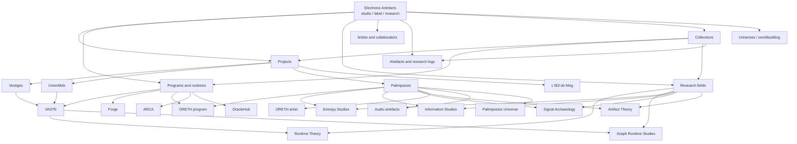
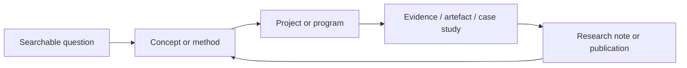

# Electronic Artefacts: Strategic Discoverability and Knowledge Platform Audit

**Audit date:** 22 June 2026  
**Scope:** SEO strategy, content architecture, knowledge graph, AI discoverability, entity strategy, digital archives and long-term platform positioning  
**Explicitly excluded:** visual design critique and general code-quality review

## Executive position

Electronic Artefacts already contains the internal model of a knowledge platform, but publishes most of that model as a portfolio interface.

The underlying corpus is substantial:

- 70 modeled entities across programs, artists, channels, research fields, projects, artefacts, research logs and fictional or conceptual universes;
- 9 curated collections;
- 7 timelines;
- approximately 635 declared entity relationships when embedded relations and the explicit graph are combined;
- no graph-isolated entities;
- mature taxonomies for status, maturity, confidence, visibility, medium, discipline and temporality;
- strong central nodes including Electronic Artefacts, VASTE, Palimpsests, VOID, UnionMob, ORETH and Vestiges.

This is not a content shortage. It is a publication, explanation and identity problem.

Most public pages explain how to move through the ecosystem, but too few explain a subject well enough to become the best independent answer to a research, technical or cultural question. The site therefore helps an already-interested human browse, while giving search engines and AI retrieval systems relatively little reason to select Electronic Artefacts as an authority.

The highest-leverage move is to create a **server-visible entity publishing system** that gives every public concept, method, technology, project, program, publication, artist and artefact:

1. a permanent descriptive URL;
2. a specific title, description and canonical identity in the initial HTML;
3. a concise definition or abstract;
4. substantive standalone exposition;
5. typed, visible relationships;
6. authorship, dates, evidence and references;
7. entity-specific structured data;
8. machine-readable representations.

That one move converts the existing private graph vocabulary into a public knowledge surface. Content production then compounds instead of accumulating as disconnected posts.

---

## 1. Current discoverability audit

### 1.1 What is already strong

The site has credible top-level discovery surfaces:

| Surface | Current role | Organic potential |
|---|---|---:|
| [Home](https://electronicartefacts.com/) | Positions the studio and routes visitors by intent | Medium |
| [Work](https://electronicartefacts.com/work.html) | Groups work across culture, software and public systems | Medium–high for branded/client discovery |
| [Projects](https://electronicartefacts.com/projects.html) | Exposes the project constellation | Medium |
| [Programs](https://electronicartefacts.com/programs.html) | Introduces runtimes and software directions | High if expanded into technical reference material |
| [Research](https://electronicartefacts.com/research.html) | Introduces the research model and fields | High if fields become substantive publications |
| [Archive](https://electronicartefacts.com/archive.html) | Preserves traces, prototypes, releases and logs | Medium–high for long-tail discovery |
| [Palimpsests](https://electronicartefacts.com/palimpsests.html) | A substantial artistic dossier | High for branded/cultural searches |
| [About](https://electronicartefacts.com/about.html) | Explains the ecosystem and lineage | Medium |

These pages are not thin. Representative rendered pages contain approximately 550–1,300 words and meaningful internal links. Research, Archive and Palimpsests are especially capable of becoming authority hubs.

Existing authority signals include:

- named proprietary systems and sustained research programs;
- project histories and lineage;
- specific collaborators and credited artists;
- delivered client work;
- technical stacks and architectural claims;
- versioned or dated activity;
- preserved prototypes and historical artefacts;
- visible distinctions among speculative, observed, validated, published and canonical material;
- an organizational schema on the homepage;
- public profiles connected to GitHub, Instagram and SoundCloud;
- an explicit archive rather than an undifferentiated feed.

The maturity and confidence taxonomies are particularly valuable. Most studios erase uncertainty; Electronic Artefacts already models it. This can become a distinctive scholarly and archival trust signal.

### 1.2 Pages most likely to attract organic traffic

Current pages with the strongest potential are:

1. **Palimpsests** — a named cultural work with an artist, album structure, acts, artefacts and a conceptual frame.
2. **VASTE** — potentially defensible around graph runtimes, contextual execution, identity systems and modular world construction.
3. **UnionMob** — unusually specific intersection of community infrastructure, governance, commerce and creative operations.
4. **Vestiges** — strong potential around living knowledge graphs for culture, craft and human know-how.
5. **L’Œil de Meg** — concrete applied evidence around photography portfolio systems, CRM design and operational tooling.
6. **Research fields** — Runtime Theory, Graph Runtime Studies, Signal Archaeology, Artifact Theory and Information Studies can answer non-branded questions.
7. **Programs** — Forge, ORETH, ARCA and OracleHub have technical and historical specificity.
8. **Archive records** — if each record explains provenance, context and significance rather than merely naming a fragment.

These surfaces can attract search because they combine distinct language, demonstrated practice and concrete artefacts. Generic studio language cannot do this.

### 1.3 Pages unlikely to attract meaningful organic traffic in their current form

- broad navigation pages without a focused query or reference purpose;
- entity pages whose primary message is “read this as a knowledge piece” rather than an explanation of the entity;
- collection pages that mainly aggregate records without an editorial thesis;
- audio artefacts with only atmospheric summaries;
- generic artist profiles with no biography, chronology, discography, roles or external references;
- project pages framed mainly as ecosystem orientation;
- research-field pages expressed only as a question;
- concepts whose names overlap broad academic fields but do not yet demonstrate a distinct Electronic Artefacts position;
- query-string records with weak stable identity outside the client-rendered experience.

### 1.4 The main crawl and identity risk

The sitemap currently declares 63 URLs, including query-string entity records. However, reusable entity templates such as `entity.html`, `project.html`, `program.html`, `artist.html`, `collection.html`, `channel.html` and `artefact.html` initially publish:

- generic titles and descriptions;
- `noindex,follow`;
- no entity-specific canonical URL.

The browser runtime later replaces these values with entity-specific, indexable metadata and a canonical URL. A fully rendered browser therefore sees a good result—for example, “Runtime Theory | Electronic Artefacts”—but a crawler that does not execute the runtime sees the generic, non-indexable template.

This creates four problems:

1. indexing depends on JavaScript execution;
2. different retrieval systems can infer different canonical states;
3. previews and link unfurlers may receive generic metadata;
4. the sitemap invites crawlers to URLs whose initial HTML tells them not to index.

This is the clearest current barrier to search and AI discoverability.

The future public form should use descriptive paths, for example:

- `/concepts/runtime-theory/`
- `/research/graph-runtime-studies/`
- `/technologies/vaste/`
- `/projects/unionmob/`
- `/artists/oreth/`
- `/collections/palimpsests/`
- `/artefacts/palimpsests/entropy/`

Query parameters may remain application-level identifiers, but they should not be the primary public identity of canonical knowledge resources.

### 1.5 What humans can discover versus what machines can discover

| Capability | Humans now | Search/AI systems now |
|---|---|---|
| Browse projects, programs, research and archive | Strong | Moderate |
| Understand that entities are related | Moderate–strong | Weak–moderate |
| See status, tags and ecosystem context | Strong after rendering | Inconsistent |
| Identify a canonical definition | Weak | Weak |
| Extract authorship and publication history | Weak | Weak |
| Verify claims against sources | Weak | Weak |
| Cite a stable passage | Weak | Weak |
| Distinguish original research from interpretation | Moderate through confidence labels | Weak without explicit claim/source structure |
| Traverse the complete graph | Moderate through interface paths | Weak without machine graph exports |
| Understand the organization behind the work | Moderate | Moderate |

The site is currently better at **orientation** than **reference**. Discoverability will improve when every important page can be understood without first understanding the ecosystem.

---

## 2. Knowledge graph audit

### 2.1 Current graph model

The current system already behaves like an internal knowledge graph:



Existing relationship predicates include origin, parent, children, dependencies, influences, derived from, inspired by, powered by, produced by, published by, maintained by, part of and related to.

This is a good start, but several predicates currently mix:

- structural containment;
- intellectual influence;
- technical dependency;
- authorship;
- production;
- publication;
- chronology;
- loose semantic similarity.

“Related to” is especially dangerous if it becomes the default. A durable graph needs relations precise enough to support reasoning.

### 2.2 Missing entity types

The future graph should add:

- **Concept** — a defined idea with scope, claims, sources and examples;
- **Method** — a repeatable procedure used in research or production;
- **Technology** — a language, library, protocol, database or technical approach;
- **Framework** — an authored conceptual or operational framework;
- **Tool** — a bounded software instrument;
- **Publication** — a formal intellectual output with authorship and date;
- **Essay** — an argued long-form publication;
- **Research Note** — a concise, citable research result;
- **Field Note** — an observation grounded in practice;
- **Case Study** — a project analyzed through problem, constraints, decisions, evidence and outcomes;
- **Dataset or Corpus** — structured evidence used or produced;
- **Event or Milestone** — a dated occurrence;
- **Claim** — an assertion attributable to a publication or research record;
- **Source** — a book, paper, website, recording, interview, repository or archival record;
- **Organization** — client, institution, studio, label, university or collaborator;
- **Place** — when geography matters to provenance or cultural context;
- **Role** — creator, researcher, developer, client, producer, publisher or maintainer;
- **Release** — versioned software, album, issue or public milestone.

### 2.3 Missing relationships

Add explicit predicates such as:

- `definesConcept`
- `appliesConcept`
- `usesMethod`
- `usesTechnology`
- `implementsFramework`
- `testsHypothesis`
- `supportsClaim`
- `contradictsClaim`
- `citesSource`
- `documentsProject`
- `resultedIn`
- `hasVersion`
- `supersedes`
- `isSupersededBy`
- `createdBy`
- `contributedBy`
- `commissionedBy`
- `fundedBy`
- `exhibitedAt`
- `releasedAs`
- `hasSubject`
- `hasPart`
- `isPartOf`
- `precedes`
- `follows`
- `occurredAt`
- `derivedFromArtefact`
- `evidencedBy`

Every visible relationship should answer a reader’s question. “VASTE powers Vestiges” is useful. “VASTE relates to Vestiges” is not.

### 2.4 Missing navigation and discovery layers

The site needs several complementary navigation modes:

1. **Domain navigation** — research, software, culture, client work, publishing.
2. **Entity navigation** — concepts, methods, technologies, projects, programs, people, organizations, artefacts.
3. **Question navigation** — “How do graph runtimes propagate context?” or “How can cultural knowledge remain living?”
4. **Relationship navigation** — powered by, derived from, documented by, influenced by.
5. **Temporal navigation** — foundation, emergence, active development, released, archived.
6. **Evidence navigation** — speculative, observed, validated, published, canonical.
7. **Format navigation** — essay, research note, case study, documentation, dataset, audio, visual.
8. **Audience navigation** — researcher, developer, designer, artist, institution, potential client.

The current interface exposes pieces of these, but not as stable, indexable landing pages.

---

## 3. Content opportunity analysis

Scores use a five-point scale.

| Content type | SEO | AI citation | Brand | Long-term value | Recommendation |
|---|---:|---:|---:|---:|---|
| Concept pages | 5 | 5 | 5 | 5 | Build first |
| Technical articles | 5 | 5 | 4 | 5 | Build first |
| Research notes | 4 | 5 | 5 | 5 | Build first |
| Case studies | 5 | 4 | 5 | 5 | Build first |
| Method pages | 4 | 5 | 5 | 5 | Build first |
| Technology pages | 4 | 4 | 4 | 5 | Build selectively |
| Documentation | 4 | 5 | 4 | 5 | Build around active systems |
| Essays | 4 | 5 | 5 | 5 | Publish slowly and substantially |
| Knowledge base entries | 4 | 4 | 4 | 5 | Use for factual reference |
| Field notes | 3 | 4 | 5 | 4 | Use to expose practice and evidence |
| Glossary entries | 4 | 4 | 3 | 4 | Only for terms actually used |
| Experimental publications | 2 | 3 | 5 | 4 | Preserve as a distinct form |
| Cultural articles | 3 | 4 | 5 | 4 | Tie to projects and sources |
| Creative technology articles | 5 | 5 | 5 | 5 | Core ownership area |

### 3.1 What to create first

The first publication wave should not be a stream. It should establish canonical nodes.

#### Pillar 1: Graph runtimes and contextual systems

- What is a graph runtime?
- Context propagation in graph-based systems
- Identity as a runtime primitive
- Event execution across mutable graphs
- Graph runtimes versus workflows, state machines and knowledge graphs
- VASTE architecture overview
- From ARCA to VASTE: an architectural lineage
- Forge as an artefact-production pipeline

#### Pillar 2: Living knowledge systems for culture and craft

- What is a living knowledge graph?
- Modeling tacit knowledge without flattening it
- Provenance for craft and cultural knowledge
- Temporal knowledge: recording change rather than only facts
- Designing Vestiges
- Human know-how as entities, relations, evidence and practice
- Ethical limits of cultural knowledge extraction

#### Pillar 3: Governed creative operating systems

- What is a governed creative operating system?
- Governance primitives for creator communities
- Linking membership, projects, decisions and commerce
- Designing auditable community workflows
- UnionMob case study
- UMOS architecture and boundaries
- AI governance in creative communities

#### Pillar 4: Artefact theory, archives and signal archaeology

- What is an electronic artefact?
- Artefacts as evidence, not decoration
- Signal archaeology: traces, degradation and reconstruction
- Archival confidence and uncertainty
- The difference between an archive, collection and knowledge graph
- Preserving failed prototypes as research evidence
- Designing an archive that remains computationally legible

#### Pillar 5: Computational approaches to artistic production

- ORETH: audio analysis as an artistic research program
- Pattern recognition in sound without reducing artistic judgment
- Bio-inspired learning and sonic structures
- Palimpsests: memory, inheritance and transmission
- Entropy and emergence as compositional structures
- Translating research fields into an album cycle

### 3.2 Content formats and their functions

Use formats as contracts:

- **Definition:** one precise answer to “What is X?”
- **Concept page:** the stable canonical identity of an idea.
- **Research note:** a bounded question, method, observation and implication.
- **Field note:** a dated observation from active work.
- **Essay:** an original argument.
- **Technical article:** a reproducible explanation or implementation.
- **Method page:** a repeatable practice with inputs, steps, limits and examples.
- **Case study:** a demonstrated application with evidence.
- **Documentation:** how an active system behaves.
- **Archive record:** provenance, context, condition and significance.
- **Collection:** an editorially argued grouping, not an automatic tag result.
- **Glossary entry:** a short definition that points to deeper resources.

Do not make each format look or read the same. Their epistemic commitments differ.

---

## 4. AI discoverability audit

### 4.1 Pages AI systems are most likely to cite

AI systems tend to cite pages that contain direct definitions, explicit claims, clear authorship, dates, evidence, stable headings and sufficient standalone context.

The best future candidates are:

- “What is a graph runtime?”
- “What is a living knowledge graph?”
- “What is a governed creative operating system?”
- “What is signal archaeology?”
- VASTE technical architecture;
- UnionMob governance case study;
- Vestiges knowledge-model case study;
- Palimpsests artistic and research dossier;
- ARCA-to-VASTE lineage;
- a controlled vocabulary for Electronic Artefacts’ entity and evidence model.

Current pages are less citable because many passages explain how the reader should interpret or navigate the page rather than delivering a self-contained factual or analytical answer.

### 4.2 Page anatomy for AI citation

Every substantive knowledge page should contain:

1. **One-sentence definition**
2. **Abstract**
3. **Key points**
4. **Main explanation**
5. **Original Electronic Artefacts position**
6. **Evidence or implementation**
7. **Limitations and open questions**
8. **Related concepts and applied projects**
9. **References**
10. **Authorship, review date and change history**
11. **Suggested citation**

Important claims should be phrased explicitly:

> Electronic Artefacts defines a graph runtime as…

> In VASTE, contextual execution means…

> The UnionMob project demonstrates…

This is not stylistic simplification for machines. It is good scholarly communication for humans.

### 4.3 Machine-readable publication

Provide:

- semantic HTML in the initial response;
- static canonical URLs;
- entity-specific JSON-LD;
- `BreadcrumbList`;
- `Article`, `TechArticle`, `ScholarlyArticle`, `SoftwareApplication`, `Person`, `Organization`, `MusicAlbum`, `MusicRecording`, `Dataset`, `DefinedTerm`, `CollectionPage` and `CreativeWork` where appropriate;
- stable `@id` values shared across all JSON-LD;
- author and publisher identities;
- `datePublished`, `dateModified`, `version`, `citation`, `about`, `mentions`, `isPartOf` and `hasPart`;
- an RSS or Atom feed for publications and research updates;
- XML sitemaps separated by entity type;
- optional JSON, JSON-LD or RDF representations for public entities;
- a downloadable public ontology or vocabulary;
- an `llms.txt` index only as a supplementary directory, never as a substitute for crawlable pages.

### 4.4 Missing explanatory resources

The following terms currently need dedicated explanations:

- electronic artefact;
- VASTE;
- graph runtime;
- contextual execution;
- identity system;
- living graph of human know-how;
- governed creative operating system;
- creative operating system;
- signal archaeology;
- artifact theory;
- runtime theory;
- anthropic studies;
- archival confidence;
- computational archive;
- modular world construction;
- artefact-production pipeline;
- cultural knowledge platform.

Without definitions, these phrases function as brand language. With rigorous pages, they can become intellectual territory.

---

## 5. Future entity strategy

### 5.1 Recommended public entity model

| Entity type | Public? | Indexable by default? | Required depth |
|---|---:|---:|---|
| Concept | Yes | Yes when substantively defined | Definition, scope, claims, examples, sources |
| Research field | Yes | Yes | Research questions, boundaries, outputs, bibliography |
| Method | Yes | Yes | Inputs, procedure, limits, examples |
| Technology | Selective | Yes when Electronic Artefacts adds original value | Role, implementation, decisions, related systems |
| Framework | Yes | Yes | Principles, model, applications, limitations |
| Project | Yes | Yes | Problem, context, process, evidence, outcomes, graph |
| Program | Yes | Yes | Purpose, architecture, lineage, releases, documentation |
| Publication | Yes | Yes | Abstract, body, author, date, citations |
| Artist | Yes with consent and substance | Yes | Biography, roles, works, chronology, external identity |
| Organization | Yes when relevant | Yes | Relationship, roles, projects, authoritative identifiers |
| Collection | Yes | Yes if editorially curated | Scope, rationale, contents, chronology |
| Artefact | Selective | Yes when it has provenance and significance | Description, provenance, context, format, rights |
| Tool | Yes for public tools | Yes | Purpose, usage, versions, related methods |
| Dataset/corpus | Selective | Yes | Methodology, license, schema, provenance |
| Internal record | No | No | Remains private |

### 5.2 Entity-page requirements

An entity page should not be generated merely because a record exists. It should be indexable when it has:

- a unique purpose;
- at least one meaningful explanatory section;
- explicit relationships;
- ownership or authorship;
- provenance;
- a stable update policy.

Thin records should remain graph nodes but consolidate into collection or index pages until they have enough public value.

### 5.3 Public relationship display

Each page should show relationships in plain language:

- **Defines**
- **Applied in**
- **Powered by**
- **Derived from**
- **Documents**
- **Created by**
- **Part of**
- **Uses**
- **Influenced by**
- **Supported by**
- **Supersedes**

The interface should explain why the relationship exists, not just display a chip.

---

## 6. Content-system design

### 6.1 Recommended URL architecture

```text
/
/knowledge/
  /concepts/
  /methods/
  /technologies/
  /frameworks/
  /glossary/
/research/
  /fields/
  /notes/
  /questions/
  /datasets/
/publications/
  /essays/
  /technical-articles/
  /field-notes/
  /experimental/
/projects/
/programs/
/artists/
/organizations/
/collections/
/artefacts/
/archive/
/timeline/
```

Do not expose all of these as equal primary-navigation items. The global navigation can remain compact:

- Work
- Research
- Knowledge
- Archive
- About

Programs, projects and publications can be strong second-level routes.

### 6.2 Cross-linking model

Every publication should link:

- upward to its research field or pillar;
- sideways to concepts and methods it discusses;
- downward to projects, artefacts or implementations that demonstrate it;
- backward to sources and predecessors;
- forward to derived work and updates.

Every project should link to:

- the concepts it applies;
- methods it uses;
- technologies or programs it depends on;
- people and organizations involved;
- evidence and artefacts produced;
- publications that explain it;
- subsequent projects influenced by it.

Every concept should link to:

- a definition;
- related and contrasting concepts;
- original publications;
- applications;
- evidence;
- unresolved questions.

This creates a loop:



### 6.3 Discovery model

Offer four primary discovery modes:

- **Search by question**
- **Browse by entity**
- **Follow relationships**
- **Explore through time**

Filters should expose status, confidence, field, medium, format, year and relationship. They should generate stable crawlable landing pages only when the combination represents a meaningful editorial category.

---

## 7. Strategic SEO territory

Electronic Artefacts should not compete for broad terms such as “web design,” “software studio,” “creative agency” or “AI development.” Those categories are commercially crowded and intellectually undifferentiated.

It can legitimately build authority around intersections demonstrated by its corpus:

### Cluster A: Graph runtimes

**Pillar:** Graph runtimes for contextual systems  
**Supporting:** context propagation, graph execution, identity primitives, event systems, simulation, VASTE, ARCA lineage.

### Cluster B: Cultural knowledge graphs

**Pillar:** Living knowledge graphs for culture and craft  
**Supporting:** tacit knowledge, cultural provenance, temporal knowledge, ethical modeling, Vestiges, knowledge preservation.

### Cluster C: Creative governance infrastructure

**Pillar:** Governed operating systems for creative communities  
**Supporting:** community governance, creator workflows, project coordination, commerce, decision records, AI governance, UnionMob.

### Cluster D: Computational archives

**Pillar:** The archive as an executable knowledge system  
**Supporting:** archival confidence, provenance, failed prototypes, digital artefacts, signal archaeology, information transmission.

### Cluster E: Computational artistic research

**Pillar:** Computational methods in artistic production  
**Supporting:** audio analysis, pattern detection, entropy, emergence, memory, artistic identity, ORETH and Palimpsests.

### Cluster F: Creative technology practice

**Pillar:** From research question to operational system  
**Supporting:** method design, research-to-product translation, prototyping, system stewardship, L’Œil de Meg, Forge.

### Required volume and horizon

A credible initial platform does not require hundreds of pages.

**First 6 months**

- 10 canonical concept pages;
- 5 strong project/program case studies;
- 6 research notes;
- 4 technical articles;
- 3 method pages;
- 1 public vocabulary;
- 1 graph explorer and timeline.

**Months 6–18**

- 20 additional concept/method/technology pages;
- 12 research or field notes;
- 6 essays;
- complete public project and program dossiers;
- archive provenance improvements;
- selected datasets and technical documentation.

**Years 2–5**

- 100–200 high-quality interconnected resources;
- stable external citations;
- institution and collaborator records;
- multilingual abstracts or publications where strategically justified;
- public graph exports and research collections;
- recurring editions, releases and bibliographies.

Compounding occurs because each new publication improves multiple existing nodes: concepts gain evidence, projects gain explanation, collections gain depth and AI systems gain corroborating passages.

---

## 8. Five-year knowledge-platform vision

In 2031, Electronic Artefacts is a public research and production graph.

A developer arrives through an article comparing graph runtimes with workflow engines. The article leads to VASTE documentation, a contextual-execution concept page, implementation notes and Vestiges.

A researcher arrives through a definition of signal archaeology. They find a bibliography, research notes, Palimpsests artefacts, archival methods and a timeline of how the concept developed.

An institution arrives through a case study on preserving craft knowledge. It reaches Vestiges, the living-knowledge-graph framework, provenance methods and a collaboration page.

An artist arrives through ORETH or Palimpsests. They can follow the work into entropy studies, audio analysis, symbolic universes and experimental publications without being forced into a software narrative.

A potential client arrives through UnionMob or L’Œil de Meg. They see concrete decisions and outcomes, then trace those decisions back to reusable methods and technical capabilities.

AI systems encounter stable pages with:

- direct answers;
- attributable original definitions;
- named authors;
- publication and modification dates;
- citations;
- entity-specific structured data;
- consistent identifiers;
- graph links to evidence and implementations.

Projects do not sit beside research. They **instantiate** it. Research does not sit beside products. It **explains and critiques** them. Publications do not sit beside programs. They **document their concepts, methods, decisions and consequences**.

The moat is the accumulated correspondence among:

- original concepts;
- implemented systems;
- documented decisions;
- preserved artefacts;
- temporal history;
- external sources;
- collaborators;
- reusable methods.

Competitors can publish articles. They cannot quickly reproduce a decade of connected intellectual and practical provenance.

---

## 9. Top 20 opportunities

Scores are 1–5. Effort is relative; lower effort is easier.

| Rank | Opportunity | Effort | Impact | SEO | AI | Brand |
|---:|---|---:|---:|---:|---:|---:|
| 1 | Publish every public entity as stable, server-visible canonical HTML | 4 | 5 | 5 | 5 | 4 |
| 2 | Establish 10 canonical concept pages with definitions, evidence and sources | 3 | 5 | 5 | 5 | 5 |
| 3 | Publish “What is a graph runtime?” as the first flagship reference | 3 | 5 | 5 | 5 | 5 |
| 4 | Turn VASTE into a technical and conceptual documentation hub | 4 | 5 | 5 | 5 | 5 |
| 5 | Publish the Vestiges living-knowledge-graph framework and case study | 4 | 5 | 5 | 5 | 5 |
| 6 | Publish the UnionMob governance-system case study | 3 | 5 | 5 | 4 | 5 |
| 7 | Add authorship, dates, references, version history and suggested citations | 3 | 5 | 4 | 5 | 5 |
| 8 | Create a public entity vocabulary and relationship ontology | 4 | 5 | 3 | 5 | 5 |
| 9 | Replace generic “related to” links with typed, explained relations | 3 | 4 | 4 | 5 | 4 |
| 10 | Turn research fields into pillar pages with boundaries and bibliographies | 3 | 5 | 5 | 5 | 5 |
| 11 | Publish ARCA → VASTE → Vestiges/UnionMob lineage as a documented timeline | 2 | 4 | 4 | 4 | 5 |
| 12 | Rebuild project profiles as evidence-based case studies | 4 | 5 | 5 | 4 | 5 |
| 13 | Create the computational archive / electronic artefact pillar | 3 | 4 | 5 | 5 | 5 |
| 14 | Expand Palimpsests into a citable artistic-research dossier | 3 | 4 | 4 | 4 | 5 |
| 15 | Publish concise research notes from existing internal research logs | 2 | 4 | 4 | 5 | 5 |
| 16 | Add entity-specific structured data with shared stable identifiers | 3 | 4 | 4 | 5 | 3 |
| 17 | Expose public graph data as JSON-LD and downloadable datasets | 4 | 4 | 3 | 5 | 5 |
| 18 | Create question-led landing pages for major research problems | 3 | 4 | 5 | 5 | 4 |
| 19 | Add publication feeds and entity-type sitemaps | 2 | 3 | 4 | 4 | 2 |
| 20 | Build an editorial governance process for confidence, review and archival status | 3 | 4 | 3 | 4 | 5 |

### Recommended execution order

**Foundation:** 1, 7, 8, 9, 16, 19, 20  
**Canonical authority:** 2, 3, 4, 5, 6, 10  
**Expansion and compounding:** 11–15, 17–18

---

## 10. Direct answers

### 1. What is Electronic Artefacts currently missing?

A public publishing layer that turns internal entities and relationships into stable, explanatory, citable resources.

### 2. What knowledge assets already exist but are underutilized?

The entity catalog, research fields, relationship graph, confidence model, timelines, collections, project lineage, internal research logs, technical program histories and archived artefacts.

### 3. What content types should be created first?

Concept pages, technical reference articles, research notes, method pages and evidence-based case studies.

### 4. What should never be turned into a blog?

The archive, entity graph, project records, program documentation, concept definitions, taxonomies and timelines. These are maintained knowledge resources, not chronological posts.

### 5. What should become a knowledge base?

Definitions, methods, technologies, frameworks, research fields, technical documentation, provenance records and controlled vocabulary.

### 6. What should become entity pages?

Concepts, programs, projects, publications, methods, artists, organizations, collections, significant artefacts, technologies and frameworks—provided each has standalone public value.

### 7. What could become a long-term competitive moat?

The graph connecting original ideas to implemented systems, documented evidence, collaborators, artefacts and history.

### 8. What architecture would make Electronic Artefacts uniquely discoverable?

A compact navigational site over a deep entity-based publication system, with typed relations, temporal and confidence layers, question-led entry points and machine-readable graph exports.

### 9. What would attract both humans and AI systems?

Clear definitions, original arguments, technical depth, concrete evidence, explicit provenance, citations, stable URLs and visible relationships.

### 10. What is the single highest-leverage move available today?

Replace query-string, runtime-dependent entity records with server-visible canonical knowledge pages, then use the existing graph to connect each page to definitions, evidence and applications.

---

## Immediate 90-day program

### Days 1–30: make the graph publishable

- define stable URL rules and entity identifiers;
- publish entity-specific initial HTML;
- remove contradictory initial `noindex` states from public records;
- define page requirements by entity type;
- normalize relationship predicates;
- add author, publication date, modification date and confidence display;
- split sitemaps by resource type.

### Days 31–60: establish authority nodes

- publish flagship pages for graph runtime, living knowledge graph, governed creative operating system, electronic artefact and signal archaeology;
- expand VASTE, Vestiges and UnionMob;
- add references and suggested citations;
- publish the ARCA-to-VASTE lineage;
- create a public vocabulary page.

### Days 61–90: create compounding loops

- publish three research notes and two technical articles;
- connect every article to concepts, projects and evidence;
- expose a public JSON-LD graph;
- add publication feeds;
- create question-led routes;
- measure discovery by landing entity, not only by pageview.

The strategic test is simple: after 90 days, a visitor or retrieval system should be able to ask “What does Electronic Artefacts know?” and receive specific, sourceable answers rather than only a map of what Electronic Artefacts contains.

---

## Evidence and sources reviewed

- [Electronic Artefacts homepage](https://electronicartefacts.com/)
- [Work](https://electronicartefacts.com/work.html)
- [Projects](https://electronicartefacts.com/projects.html)
- [Programs](https://electronicartefacts.com/programs.html)
- [Research](https://electronicartefacts.com/research.html)
- [Archive](https://electronicartefacts.com/archive.html)
- [About](https://electronicartefacts.com/about.html)
- [Palimpsests](https://electronicartefacts.com/palimpsests.html)
- [VASTE program record](https://electronicartefacts.com/program.html?id=vaste)
- [UnionMob project record](https://electronicartefacts.com/project.html?id=unionmob)
- [Runtime Theory record](https://electronicartefacts.com/entity.html?id=runtime-theory)
- [Runtime Collection](https://electronicartefacts.com/collection.html?id=runtime-collection)
- [ORETH artist record](https://electronicartefacts.com/artist.html?id=oreth)
- [Foundational Lineage #001](https://electronicartefacts.com/artefact.html?id=foundational-lineage-001)
- [Robots policy](https://electronicartefacts.com/robots.txt)
- [XML sitemap](https://electronicartefacts.com/sitemap.xml)
- Workspace entity, relation, taxonomy, timeline, collection and search-index data used to verify graph scale and public visibility.

This is a strategic audit, not a measured ranking report. Search Console, analytics, backlink data, server logs and third-party rank-tracking data were not supplied, so claims about current traffic or rankings should be validated against those systems before setting numerical growth targets.
